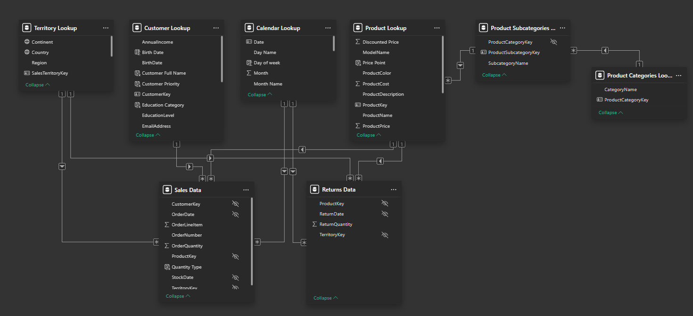
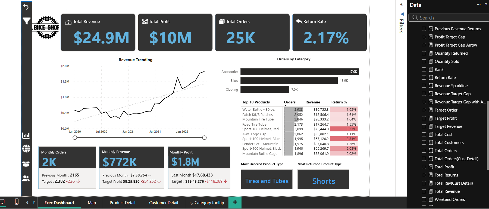
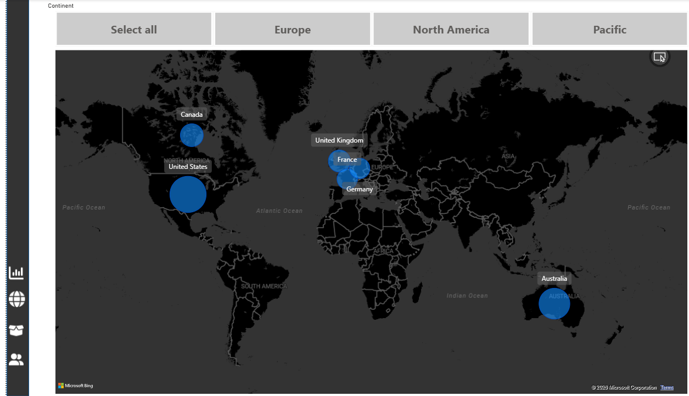
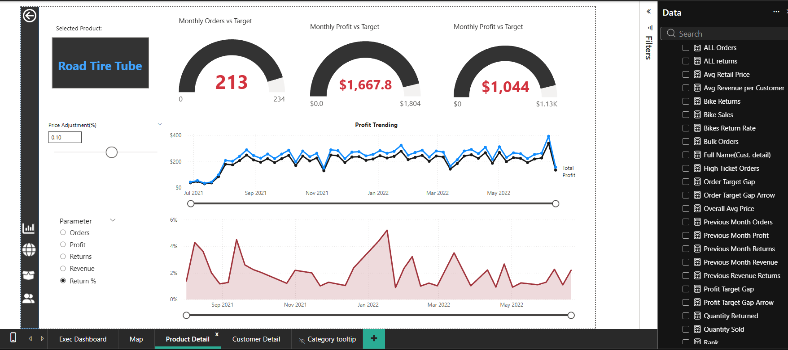
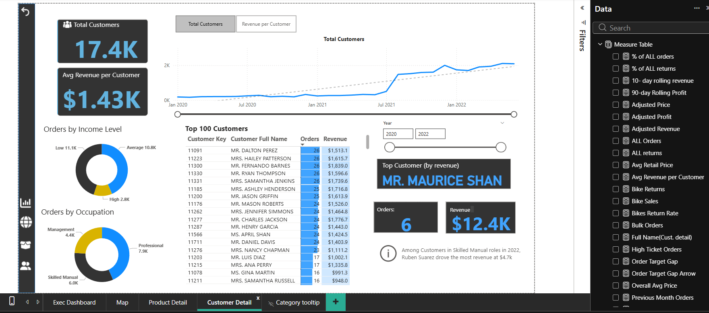

## 🚴Power BI-Sales-Analysis-Dashboard
In this project, we perform sales data analysis to track business performance across revenue, profit, orders, customers, and returns using Power BI.
## Table of Contents
- [Project Overview](#project-overview)
- [Problem Statement](#problem-statement)
- [Data Source](#data-source)
- [Data Cleaning & Preparation](#data-cleaning--preparation)
- [Data Modeling](#data-modeling)
- [Dashboard Pages & Features](#dashboard-pages--features)
- [Insights](#insights)
- [Executive Recommendations](#executive-recommendations)
- [Tools & Technologies](#tools--technologies)

## Project Overview
This project focuses on building an end-to-end Sales Analysis Dashboard using Power BI, aimed at tracking business performance across revenue, profit, orders, customers, products, and returns.
The dashboard is fully dynamic and interactive, enabling users to analyze trends over time, compare performance against targets, drill down into product and customer details, and identify key drivers of profitability and returns.

The project demonstrates real-world Power BI skills, including data modeling, Power Query transformations, advanced DAX measures, and interactive reporting using slicers, parameters, and bookmarks.

## Problem Statement 
Sales teams and decision-makers often struggle to answer questions like:

- How is revenue and profit trending over time?

- Which product categories and products drive the most orders and returns?

- Are monthly sales, profit, and orders meeting targets?

- Which customers contribute the highest revenue?

- How do returns impact overall profitability?

This project addresses these questions by converting raw transactional data into actionable insights through a centralized Power BI dashboard.

## Data Source
The dataset consists of structured sales and returns data, including:

- Sales transactions (orders, quantities, revenue, cost, profit)

- Returns data (returned quantities, return rate)

- Customer attributes (income level, occupation, geography)

- Product hierarchy (category, subcategory, product details)

- Calendar table for time-based analysis

- Territory data for geographic insights

## Data Cleaning & Preparation
Data preparation was performed using Power Query, including:

- Promoting headers and correcting data types

- Currency formatting for revenue and profit fields

- Removing irrelevant and redundant columns

- Renaming columns for clarity and consistency

- Filtering invalid or incomplete records

- Creating derived columns using text and mathematical transformations

- Ensuring clean keys for relationships across tables

These steps ensured the dataset was analysis-ready and optimized for performance.

## Data Modeling
Implemented a star schema data model

- Fact tables:

       Sales Data

       Returns Data

- Dimension tables:

      Calendar Lookup

      Customer Lookup

      Product Lookup

      Product Category & Subcategory Lookups

      Territory Lookup

- One-to-many relationships with proper filter direction

- Separate Measure Table created to organize all DAX measures
### Data Modeling

## Dashboard Pages & Features
1️⃣ Executive Dashboard

- KPIs:

       Total Revenue

       Total Profit

       Total Orders

       Return Rate

- Revenue trend analysis with time intelligence

- Orders by product category

- Top products by orders, revenue, and return percentage

- Monthly performance vs targets (Orders, Revenue, Profit)
  
- Most ordered and most returned product types

- Custom navigation panel and clear-filters functionality using bookmarks

 ### Executive Dashboard
 

2️⃣ Geographic Analysis (Map Page)

 - Customer distribution across continents

 - Geographic contribution to sales and customers

 - Interactive map visuals for regional insights
### Geographic Analysis

3️⃣ Product Detail Analysis

 - Product-level drill-down

 - Monthly Orders vs Target (Gauge)

 - Monthly Profit vs Target (Gauge)

 - Profit trend analysis

 - Return % trend over time

 - Dynamic What-If parameter for price adjustment

 - Metric selector (Orders, Profit, Revenue, Returns, Return %)

This page enables scenario analysis and product performance evaluation.
### Product Detail Analysis

4️⃣Customer Detail Analysis

 - Total customers and average revenue per customer

 - Customer growth trend over time

 - Orders segmented by income level and occupation

 - Top 100 customers by revenue

 - Identification of top customer by revenue

 - Year-based filtering for comparative analysis
### Customer Detail Analysis

## Insights 

 - Revenue and profit show a strong upward trend over time, with seasonal fluctuations

 - Accessories and bikes contribute the highest order volumes

 - Certain high-selling products also exhibit higher return rates, impacting net profit

 - Customer growth accelerates significantly after mid-2021

 - A small subset of customers contributes disproportionately to total revenue

 - Monthly performance frequently misses targets, highlighting optimization opportunities

## Executive Recommendations
 Strategic Priorities for Stakeholder Action

 ### Reduce Product Return Rates:
    Address the 2.17% overall return rate, particularly Sport-100 Helmets (3.81% and 2.68% return rates). Implement enhanced quality control and customer feedback loops to minimize       returns and protect          profit   margins.
 ### Close Monthly Revenue Gap: 
    Current monthly revenue ($772K) is underperforming against targets. Deploy targeted promotional campaigns and seasonal marketing initiatives to bridge the $54K monthly profit gap and   achieve quarterly          objectives.
 ### Optimize High-Performing Products:
    Prioritize inventory for top sellers—Water Bottles (3,983 orders) and Accessories (17.0K total orders). Ensure zero stockouts and create strategic product bundles to increase   average order value from           $1.43K.
 ### Develop VIP Customer Program:
    Top 100 customers drive disproportionate revenue (e.g., Mr. Maurice Shan: $12.4K from 6 orders). Launch a retention program targeting high-value customers to maximize lifetime       value across the 17.4K        customer base.
 ### Expand Professional Segment Marketing:
    With 7.9K orders from Professional occupations, establish B2B partnerships and corporate sales channels to capture additional market share in this high-potential segment.
 ### Improve Profit Margins: 
    Despite $24.9M revenue generating $10M profit (40% margin), monthly profit ($1.8M) lags targets significantly. Conduct cost-structure analysis to identify margin enhancement               opportunities           without compromising quality.
 ### Leverage Revenue Growth Momentum:
    Capitalize on the consistent upward trend (from $0.5M to $2.0M over 2 years) by scaling successful strategies and replicating high-performing periods across slower months.
 ### Implement Income-Based Targeting: 
    Differentiate marketing strategies across income segments (Low: 11.1K, Average: 10.8K, High: 2.8K customers) with tailored product offerings and pricing strategies to maximize   penetration in each segment.

## Tools & Technologies

    - Power BI

    - Power Query

    - DAX

   -  Star Schema Data Modeling

   -  Interactive Dashboards & Bookmarks

